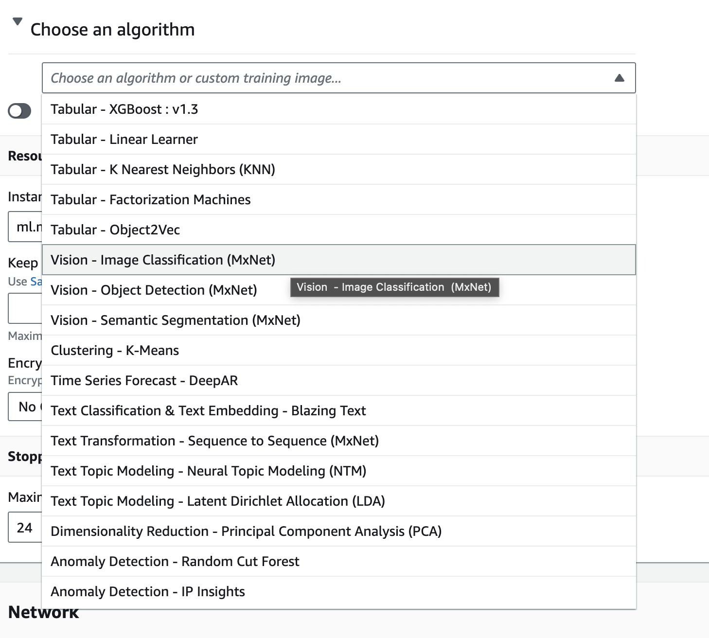
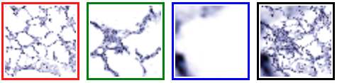
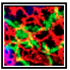
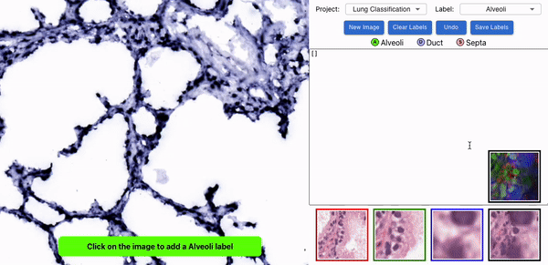
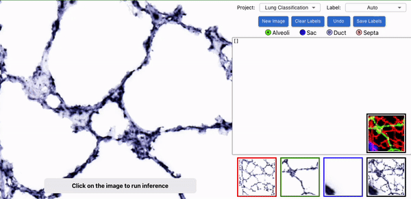
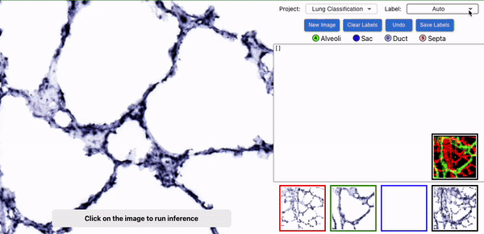
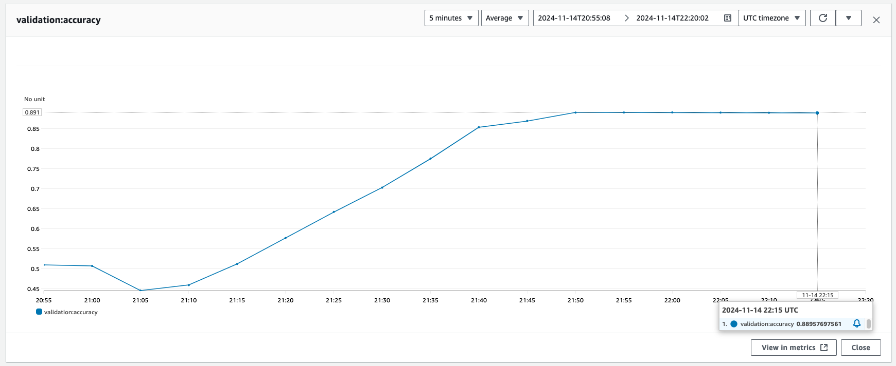
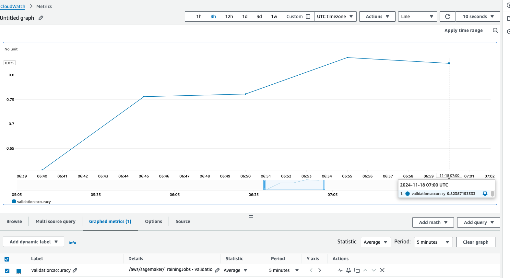
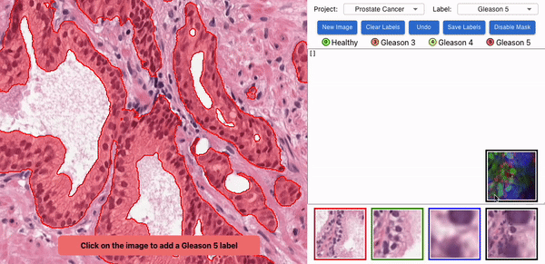

# cv-lung-classification

## Description
The goal of this project was to create a pixel by pixel image classification tool using AWS Sagemaker, state of the art deep learning models and ReactJS framework. This model is able to infer whether any given coordinate in a histological sample of a rat lung is an alveoli, septa or duct. 

Having an inference tool has many benefits, including reducing subjectivity of classification that may occur between different individual’s labeling. Instead, the classification model is trained off of labeling information provided by a single individual with assumed expertise.
The goal was to increase efficiency while maintaining a high level of accuracy.

## Model/Hardware Specs:
Pretrained ResNet-18 architecture with Adam optimizer. 
The model leverages MXNet as the deep learning framework, and uses CUDA and GPU acceleration (specifically a Tesla K80 GPU).



## Hyperparameter Configuration (SageMaker):


## Methods
Histological lung images came from LungMAP: ```https://www.lungmap.net/explore-data/visualize-data/?main_tab_id=two_d_imaging&image_tab_id=histology```
We used different color channels, associated with different zoom levels of an image to train the classification model. 
The blue colored channels were associated with the standard 1x zoom level (50x50 pixel size). 
Red channel was zoomed out by 24x.
The green channel zoomed out by 8x. 




These images were overlayed on top of each other for training data of the classification model: 



We wanted to compare the inference accuracy of the Color and Zoom Associated Channels method (CaZaCs) vs. standard labeling data (standard zoom level, and no color channels). 


### Labeling Lung Components:



### Live Inference Tool:



### You can now do multiple pixel selection inference!


## Results
We successfully developed an automated classification system that:
1. Uses labeled pixel data to train classification models
2. Provides an intuitive interface for collecting labeled data
3. Supports multiple tissue types and classification categories
4. Enables real-time inference using deployed models


## Validation Accuracy Results
### Results: Training Data Using Color and Zoom Associated Channel Method (CaZaC)




### Results: Without CaZaC


 

## Further Directions
* Experiment with more tissue types/classifications
* Generate segmentation label data from pixel level classification

## UPDATES!
We added prostate histological images from the Prostate cANcer graDe Assessment (PANDA) Challenge: ```https://www.kaggle.com/c/prostate-cancer-grade-assessment/data```. 
We wanted to see if CazaC could outperform standard classification methods for diagnosis of prostrate cancer using the Gleason grading system (results are pending).


You're now able to enable and disable the past label masks!


## Getting Started

### Dependencies
* Node v18
* AWS account

### Setup
* Make sure NVM (Node Version Manager) is installed
```
curl -o- https://raw.githubusercontent.com/nvm-sh/nvm/v0.40.1/install.sh | bash
wget -qO- https://raw.githubusercontent.com/nvm-sh/nvm/v0.40.1/install.sh | bash
```
Running either of the above commands downloads a script and runs it. 
The script clones the nvm repository to ```~/.nvm```, and attempts to add the source lines from the snippet below to the correct profile file ```(~/.bash_profile, ~/.zshrc, ~/.profile, or ~/.bashrc)```

* Load nvm:
```
export NVM_DIR="$([ -z "${XDG_CONFIG_HOME-}" ] && printf %s "${HOME}/.nvm" || printf %s "${XDG_CONFIG_HOME}/nvm")"
[ -s "$NVM_DIR/nvm.sh" ] && \. "$NVM_DIR/nvm.sh" 
```

* Install nvm
```
nvm install 18
nvm use 18
```
### How to run
* Clone this repo:
```
git clone https://github.com/neltomw/cv-lung-classification-tool.git
cd cv-lung-classification-tool
```
* Enter your AWS credentials in App.js:
```
const env = {
 "ACCESS_KEY": "*",
 "SECRET_KEY": "*",
 "REGION": "*"
};
```
